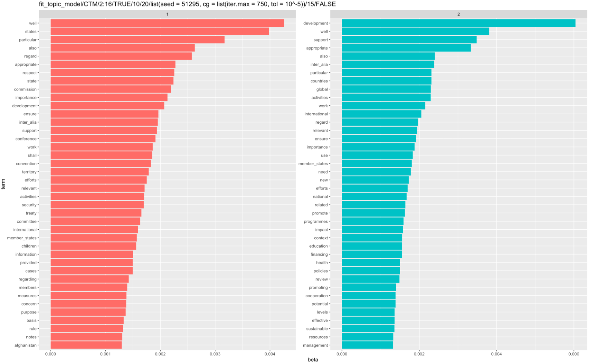
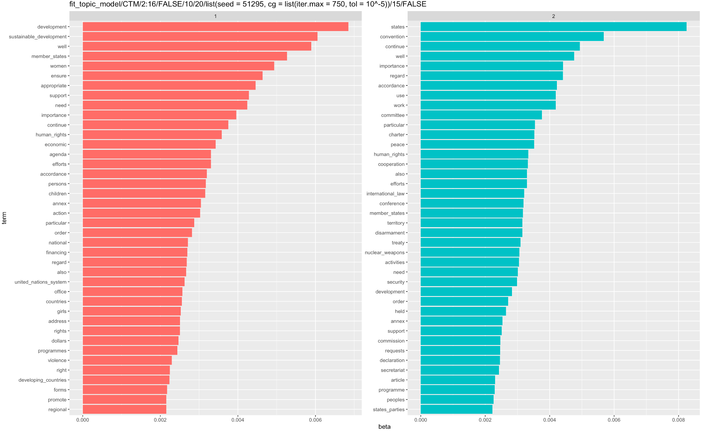
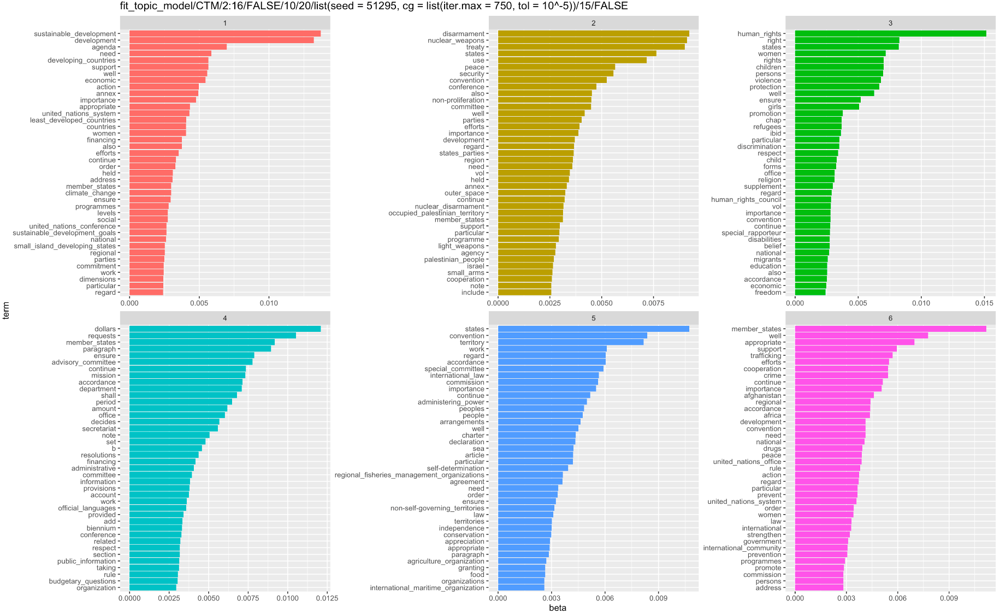

# Topic Modelling

## LDA 

**EXPLAIN LDA THEORY HERE**

## CTM

**EXPLAIN CTM THEORY HERE**

## Pipeline

In order to come up with topics for the resolutions at the UNGA, we need to explicitly define a text mining pipeline. That is, there are several steps and decisions to be made that allows one to come up with a given matrix $\Lambda$ of topic proportions for resolutions. 

  1. **Data**: We could restrict ourselves to a given subset of resolutions, use the complete 2012-2020 data we have thus far, or extend the analysis once we have more data available. 
  2. **Document Texts**: Once we have settled on the period or resolutions considered, we have to decide if we wish to use the raw version of the text or if we are happy with the simplified version that removed preambulatory and operational phrases (POP). While this step may be considered a special version of removing stopwords, it comes first in the pipeline since POP may be considered part of the structure of a UN resolution more than stopwords. 
  3. **Corpus**: With a given data set and document texts we can construct a corpus. 
  4. **Tokenization**: An important part of text mining is to separate documents into *tokens* which can be thought of as its basic elements. These are usually words, but may include punctuation, symbols or spaces. That is why, when converting our resolutions into tokens we have to decide if we remove punctuation, symbols, numbers, and spaces. 
  5. **Stopwords**: There are some words in a given language that are considered noise and judged not to convey any substantial meaning to a text mining analysis. Examples usually include articles or pronouns. These are called stopwords and may be removed prior to any modelling. One should decide which are the stopwords and whether or not to remove them. Given a particular context one may wish to either modify existing general lists of a given language stopwords or extend them by identifying domain specific stopwords.
  6. **Collocations**: Another important step is to decide whether or not to consider *collocations* which are pairs, triplets or, in general, $n$-length consecutive words that convey a distinct meaning when considered as a single word. Examples are names, such as United Nations or International Court of Justice. To decide whether or not an expression constitutes a collocation one has to decide the lengths or sizes to consider, i.e. whether we are looking for two-words expressions, or $n$-words expressions in general. Also, one has to set a minimum number of occurences of the expression to be considered as a collocation. Once those expressions satisfying both conditions are identified a criteria must be set to decide if they are indeed a collocation that conveys a distinct meaning. The used criteria is a $z$ score bigger than 3 as costumary in `quanteda` analyses (`textstat_collocations` has more details). 
  7. **Final Tokens**: Before considering models one may wish to also exclude some other tokens. For example, one may wish to consider only tokens with given lengths, removing or not one or two characters tokens. Additionally, one may establish a minimum token frequency. 
  8. **Topic Model**: Only after all the previous steps have been completed we can fit a model to the final dataset. The models considered here can be defined by the number of topics $k$ and its type, LDA or CTM, as well as possibly some control parameters for the computer algorithm used to fit them. These last parameters include, for example, the seed or the maximum number of iterations. 
  
This process is implemented in the following **pipeline function**:

```{r}
fit_topic_model <- function(model, k, 
                            data = resol_text_df, 
                            text_field = "Resol_Text_WPOP", docid_field = "ID_FAZH",
                            remove_punct = TRUE, remove_symbols = TRUE, remove_numbers = TRUE, 
                            en_stopwords = stopwords("en",source = "marimo"), 
                            coll_size = 2:5, coll_min_count = 15,
                            unga_stopwords = unga_stopwords,
                            remove_1_2l_words = TRUE, 
                            min_term_freq = 15, 
                            seed = 51295, ...){
  
  corpus_unga <- data %>% 
    corpus(text_field = text_field, docid_field = docid_field)
  
  tokenized_unga <- corpus_unga %>% 
    tokens(remove_punct = remove_punct, 
           remove_symbols = remove_symbols, 
           remove_numbers = remove_numbers, 
           padding = T) %>% 
    tokens_remove(pattern = en_stopwords, padding = TRUE) 
  
  if(remove_1_2l_words){
    tokenized_unga <- tokenized_unga %>% 
      tokens_keep(min_nchar = 3)
  }
  
  collocations_nested <- tokenized_unga %>% 
    textstat_collocations(size = coll_size, min_count = coll_min_count)
  
  tokenized_unga_col <- tokenized_unga %>% 
    tokens_compound(pattern = collocations_nested[collocations_nested$z > 3])
  
  tm_unga <- tokenized_unga_col %>% 
    tokens_remove(unga_stopwords) %>% 
    dfm() %>%
    dfm_trim(min_termfreq = min_term_freq) %>% 
    convert(to = "topicmodels")
  
  set.seed(seed)
  if(model == "LDA"){
    print("Model: LDA")
    model_unga <- mclapply(k, LDA, x = tm_unga, ...)
  } else{
    print("Model: CTM")
    model_unga <- mclapply(k, CTM, x = tm_unga, ...)
  }
  
  return(list(fitted_model = model_unga, call = sys.call()))
  
}
```


## Parameters considered

With the pipeline function we can now consider several models by varying its parameters. First, we can mention some parameters that will remain the same for all the models considered. These are: 

  - `data`: Complete 2012-2020 dataset
  - `text_field`: We are removing POP words
  - Basic removal parameters: We remove punctuation, symbols, and numbers. 
  - Stopwords: we are removing three types of stopwords
    - The `marimo` English stopwords
    after collocations and a trial frequency analysis, the following context specific words
    - The context specific stopwords "including","resolution","implementation", "united_nations","secretary-general","general_assembly". These were identified in trial analyses.
    - Spaces and the footnotes separator symbol "_______________"
  - `coll_size`: Valid lengths of collocations are 2 to 5
  - Control parameters: all algorithms used the same seed, maximum iteration parameters, tolerance, and cores. 

Then, we varied the following parameters

  - Minimum frequencies: 3 pairs of minimum length for collocations and term frequencies for analyses were considered (`coll_min_count`, `min_term_freq`): (10, 20), (50, 50), and (100, 75). 
  - Removal of 1 and 2 letter words or not.
  - Model: type LDA or CTM.
  - Number of topics $k$: from 2 through 16. 
  
This meant in total 180 models (3 x 2 x 2 x 15)

## Exploration of Topics

**EXPLAIN EXPLORATION OF TOPICS ALONG WITH GOOD PLOTS**





