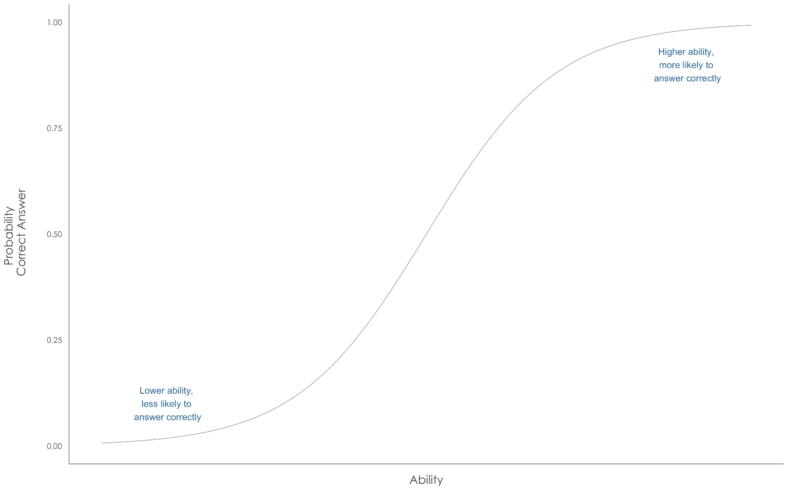
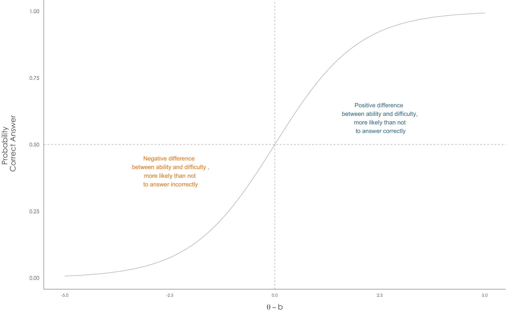
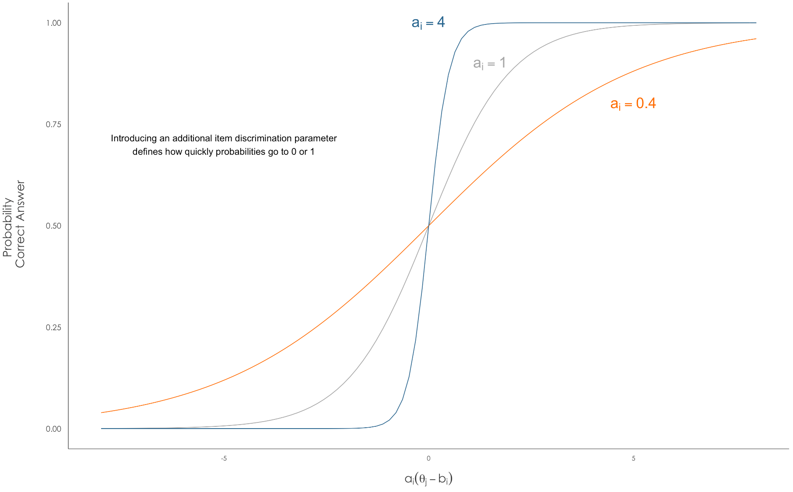

# Item Response Theory

## Basic concepts and models

The fundamental idea underpinning Item Response Theory (IRT) is that one attempts to "measure something that [does] not exist as a directly observable or *manifest variable*" [@Linden16a] but is instead *latent*. In many applications, mostly from educational and psychometric domains, this latent variable is considered an *ability* and one intends to measure it via several *items* or questions related to it [@Linden16 ; @Baker.Kim17]. The way items help measure abilities is that it is generally thought that people with higher abilities are more likely to answer correctly items intended to measure said ability. 

More precisely, suppose we define a given item's difficulty as $b$ on the ability scale and a given person's ability as $\theta$ on the same scale. We would say that people with higher abilities than the item's difficulty, $\theta > b$, are more likely to answer it correctly. On the contrary, a person whose ability level is smaller than the item's difficulty , $\theta < b$, will have a low probability of answering correctly. Moreover, what we would actually like to say is that there exists an increasing probability of answering correctly with the **difference** between an individual's ability and an item's difficulty. 

We could express this notion for example as
$$P(Y = 1 | \theta, b) = F(\theta - b)$$
where $Y=1$ represents a correct answer and $F$ is an increasing cumulative distribution function [@SanMartin16]. Several functions are available, amongst the most popular are the logistic, normal, and extreme value of the Gumbell type [@Albert16]. 

### 1PL or Rasch Model

Now, we are usually interested in measuring several individuals and have more than one item to do so. Let us say we have $J$ individuals with abilities $\theta_j$ for $j = 1, 2, \dots, J$ and $I$ items with difficulties $b_i$ for $i=1, 2, \dots, I$. We would also have $N$ answers $Y_k$, $k=1,2,\dots,K$ which are either correct or incorrect for a given individual-item pair. If we have a logistic response function our basic IRT model could look like this: 

$$Y_k|\theta, b \overset{ind}{\sim} Ber(p_k) \qquad p_k = P(Y_k = 1 | \theta, b) = \dfrac{\exp(\theta_{j[k]} - b_{i[k]})}{1 - \exp(\theta_{j[k]} - b_{i[k]})}$$
for $k = 1, 2, \dots, K$ and where the notation $j[k]$ and $i[k]$ identify the correct individual and item indexes of the $k$-th answer. 

It is usually called the 1PL (1 item Parameter Logistic) or Rasch model.

### 2PL and Normal Ogive Model

There are other models that introduce an additional item parameter beyond its difficulty. These are normally denoted by $a_i$ and called the discrimination parameters since they signal how much an item discriminates between individuals with abilities slightly higher or lower than the difficulty of the item. This so-called 2PL model is a generalization of the 1PL:

$$p_k = P(Y_k = 1 | \theta, a, b) = \dfrac{\exp\left\lbrace  a_{i[k]}(\theta_{j[k]} - b_{i[k]})\right\rbrace}{1 - \exp\left\lbrace a_{i[k]}(\theta_{j[k]} - b_{i[k]})\right\rbrace}$$
for $k = 1, 2, \dots, K$.

Some comments are in order: 

  - 1PL is a special case where all $a_i = 1$.  
  - Graphically, we can see that bigger values of $a_i$ indicate a sharper curve that goes quicker to 1 or 0, whereas lower magnitudes yield flatter curves. 
  - A negative value of $a_i$ would indicate that higher able individuals are less likely to answer correctly. This is generally indicative of a bad test item in educational or psychometric tests but in other contexts it may be reasonable. 
  - One can think of $a_i$ as scaling, that is magnifying or reducing, differences between abilities and difficulties.
  - Another way of representing the model is with a linear predictor $\eta_k = \alpha_{i[k]} + \beta_{i[k]}\theta_{j[k]}$, this is a notation that resembles traditional logistic regression and where $\alpha_{i[k]} = a_{i[k]}b_{i[k]}$ and $\beta_{i[k]} = a_{i[k]}$.
  - There is no absolute restriction in that the response or link function has to be logistic. In fact, another famous model, proposed by Lord, is the Normal Ogive model which has the same structure except that it replaces the logit link for the probit, that is the logistic cdf for the normal cdf, hence the name. 

### 3PL or 4PL

A third additional parameter may be a pseudo-guessing parameter in which respondents are allowed to have a correct answer by virtue of "guessing" regardless of their abilities. This is a common model in the IRT literature and is expressed as: 

$$p_k = P(Y_k = 1 | \theta, a, b, c) = c_{i[k]} + (1-c_{i[k]})\dfrac{\exp\left\lbrace  a_{i[k]}(\theta_{j[k]} - b_{i[k]})\right\rbrace}{1 - \exp\left\lbrace a_{i[k]}(\theta_{j[k]} - b_{i[k]})\right\rbrace}$$
for $k = 1, 2, \dots, K$.

[@Bafumi.etal05] propose what they call a robust logistic regression model and that we could call the 4PL in which in addition to the pseudoguessing parameter, they also allow random mistakes regardless of abilities. This is a robust model in the sense that they look to allow some outliers in which either low ability respondents answer correctly to items they were not supposed to or high ability respondents exhibit some mistakes that their ability level wouldn't consider likely. Their expression would be akin to

$$p_k = P(Y_k = 1 | \theta, a, b, c, d) = c_{i[k]} + (1-c_{i[k]} - d_{i[k]})\dfrac{\exp\left\lbrace  a_{i[k]}(\theta_{j[k]} - b_{i[k]})\right\rbrace}{1 - \exp\left\lbrace a_{i[k]}(\theta_{j[k]} - b_{i[k]})\right\rbrace}$$
for $k = 1, 2, \dots, K$.

### MIRT

One could extend IRT models to consider several dimensions of the latent abilities [@Swaminathan.Rogers16; @Reckase16; @Reckase09]. For example, a generalization of the Normal Ogive model in its linear predictor form would be similar in appearence to a probit regression:

$$p_k = P(Y_k = 1 | \theta, \alpha, \beta) = \Phi\left[ \alpha_{i[k]} + \beta_{i[k],1}\theta_{j[k],1} + \beta_{i[k],2}\theta_{j[k],2} + \dots + \beta_{i[k],D}\theta_{j[k],D}\right]$$
where now, instead of a scalar ability $\theta_{i}$ each individual is positionned on a $D$-dimensional ability coordinate  $\theta_{i} = (\theta_{i, 1}, \theta_{i, 2}, \dots, \theta_{i, D})$. Each item would have associated an intercept $\alpha_j$ parameter and a corresponding $D$-dimensional coefficients vector $\beta_{j} = (\beta_{j, 1}, \beta_{j, 2}, \dots, \beta_{j, D})$. 

Reckase calls this, and its logistic version, a compensatory MIRT model because 

  > an examinee whose location in the space has a high value for one coordinate can balance out a low value for another coordinate to yield the same probability of the item score as an examinee who is located aat a place represented by coordinates of roughly equal magnitude. [@Reckase16]
  

## STILL QUESTIONS ON

### Latent variable form

QUESTION: IS IT CORRECT TO SAY THAT THIS FORMULATION WOULD BE EQUIVALENT TO HAVING A Z LATENT VARIABLE PLUS ERROR AND THE CHOICE OF ERROR DISTRIBUTION DETERMINES THE LINK: 

$$Y = 1 \Longleftrightarrow Z > 0 \qquad Z = \eta + \epsilon$$

Where $\eta$ may be of the Rasch form ($\eta = \theta - b$), the Lord form ($\eta = a(\theta - b)$) or the MIRT form ($\eta = \alpha + \underline{\beta}'\underline{\theta}$), and $\epsilon$ is interpreted as normal, logistic or Gumbell (assymetric) error. 

### Identifiability

QUESTIONS: I AM AWARE OF THE FOLLOWING IDENTIFICATION ISSUES IN THE 2PL OR NORMAL OGIVE MODEL, mostly from reading [@Bafumi.etal05; @SanMartin16; @Bailey.etal17; @Lauderdale.Clark14]

- ADDITIVE NON-IDENTIFIABILITY/LOCATION: translating the scale, adding and subtracting same constant to abilities, difficulties
- MULTIPLICATIVE/ SCALE: multiplying and dividing discriminations and abilitiy differences
- REFLECTION: Changing all the signs of discrimination parameters

It seems, from  [@SanMartin16] that a necessary and sufficient condition for identification on 2PL would be to set arbitrarly one difficulty and one discrimination to $1$. [@Bafumi.etal05] recommend some approaches based on priors, they seem to include a unanimous vote/item with all correct answers to help with this (p. 181), or using some adjusted parameters by normalizing all of them via the mean and standard deviation of estimated abilities. 

But I'm not sure how this translates to the MIRT, for example, [@Lauderdale.Clark14] seem to talk about a ROTATION non-identifiability akin to the REFLECTION one and say they explicitly don't allow, for example, people voting in favor of a right-wing opinion economically but left-wing opinion socially. I don't know exactly how they accomplish this on their models especially considering they end up having way more than 2 dimensions. 

